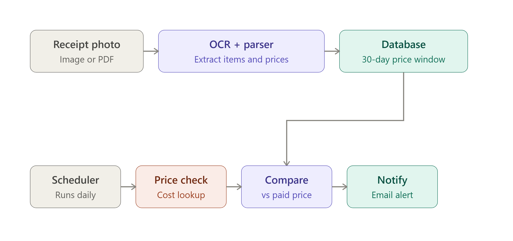

# Costco-Price-Guarantee
## Project overview

Automates Costco's 30-day price-adjustment policy: scan a receipt, get notified if any item's price drops within its refund window.
Built as a full pipeline: OCR → structured parsing → price monitoring → refund calculation.

## Architecture / pipeline

Receipt image → Google Cloud Vision OCR → word-level bounding-box reconstruction → structured item records (Postgres via SQLAlchemy/pandas).
Price monitoring → currently manual/semi-automated (see "Engineering findings" below) → refund-amount calculation on any detected drop.

## Technical challenges solved
* Two-column OCR reconstruction: Vision's raw text output groups words by visual block, not physical row, and costco has two-column receipts. This was solved by reconstructing rows from word-level bounding-box coordinates found in the OCR json file.
* Photo skew correction: a tilted photo causes the same physical row to have different y-coordinates at different x-positions — solved by clustering left/right columns separately and pairing by order rather than absolute position.
* Print-layout quirks: tax-marker glyphs printed off-baseline from item text required filtering rather than tolerance-tuning.
* Data-boundary isolation: column/row detection had to be scoped to the item table specifically, since payment-summary text elsewhere on the receipt has a different layout and contaminates whole-document parsing.
* Discount-line reconciliation: Costco prints instant-savings as separate negative-price rows immediately following the discounted item — merged programmatically with an exception check.

## Engineering findings: Costco's anti-bot defenses

* I Systematically tested plain requests (blocked at the application layer and returned error code HTTP 403) and then tried Playwright across 4 configurations (headless/visible Chromium with/without HTTP/2, headless Firefox) to isolate the actual defense mechanism.
* After these tests I was able to track the block to Akamai Bot Manager (confirmed via the errors.edgesuite.net domain in the returned block page) — an enterprise-grade anti-bot system, and not one I could get around.
* Documented decision: rather than escalating farther past my skill level to try to get around the anti-bot system, I pivoted to a manual/semi-automated price-check design, a deliberate engineering tradeoff.

Tech stack: Python, Google Cloud Vision API, Postgres, SQLAlchemy, pandas, Playwright
